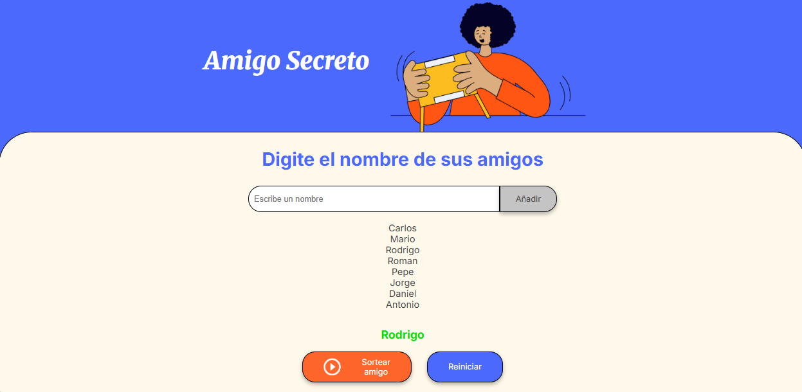

# Challengue-Amigo-Secreto

Este proyecto es una aplicación sencilla en **JavaScript**, **HTML** y **CSS** que permite:

- Agregar nombres a una lista de amigos.  
- Visualizar todos los amigos registrados.  
- Realizar un sorteo para elegir un **amigo secreto** de forma aleatoria.  
- Reiniciar la lista cuando sea necesario.  

---

## 🚀 Funcionalidades

- ✍️ **Agregar amigos**: escribe un nombre en el input y se añadirá a la lista.  
- 🔄 **Reiniciar**: vacía la lista y limpia los resultados.  
- 🎲 **Sortear amigo secreto**: selecciona un nombre aleatorio de la lista.  
- ✅ **Validaciones**: evita nombres vacíos o repetidos.  

---

## 🛠️ Tecnologías utilizadas

- **HTML5** → estructura del proyecto.  
- **CSS3** → estilos básicos y centrado de elementos.  
- **JavaScript (Vanilla JS)** → lógica del programa (manejo de la lista, validaciones y sorteo).

---

## 📸 Vista previa  

👉 [Ver proyecto en línea](https://antonio-olivera.github.io/Challengue-Amigo-Secreto/)

